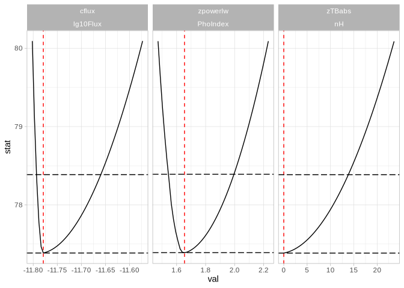
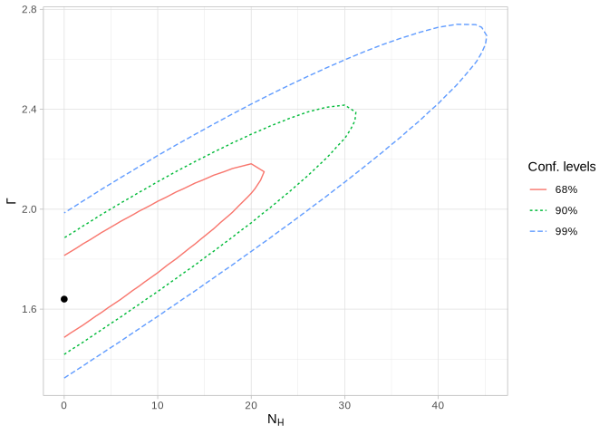

<!-- README.md is generated from README.Rmd. Please edit that file -->

# rxspec

<!-- badges: start -->

<!-- badges: end -->

Interface to ‘PyXspec’ from R.

## Installation

Before using `rxspec`, make sure `PyXspec` is available in your
environment:

1.  Install HEASoft with XSPEC.

2.  Initialize the HEASoft environment with `heainit`.

3.  Launch R or your Jupyter kernel only after the HEASoft environment
    has been initialized.

## Example workflow

``` r
library(rxspec)
library(ggplot2)
theme_set(theme_light())
```

``` r
x1 <- xsession() |>
        set_fit_settings(
            statMethod = "cstat",
            nIterations = 300L,
            query = "yes"
        ) |>
        set_parallel_settings(
            leven = 30L,
            error = 30L,
            walkers = 30L
        ) |>
        load_data(YOUR_SPEC_FILE) |>
        ignore("bad") |>
        print(files = FALSE)
#> loading  1:1 artxc_min5.pha 
#> <rxspec session>
#>   PyXspec: 2.1.5 
#>   XSPEC:   12.15.1 
#>   spectra: 1
#>   model:   none
#> # A tibble: 1 × 4
#>     dof testStatistic statistic pval  
#>   <int>         <dbl>     <dbl> <chr> 
#> 1     0             0         0 >0.999
```

``` r
x1 <- x1 |>
  set_plot_settings(
        min_sign = 3,
        max_bins = 100000L,
        group_num = 2L
    ) |>
    make_model("TBabs*zTBabs(cflux*zpowerlw)") |>
    set_params_by_name(
        TBabs.nH = "0.05 -1",

        zTBabs.nH = "0 -1",
        zTBabs.Redshift = 0.05,

        cflux.Emin = "4",
        cflux.Emax = "12",
        cflux.lg10Flux = "-12",

        zpowerlw.PhoIndex = "1.8 -1",
        zpowerlw.Redshift = "=3",
        zpowerlw.norm = "1 -1"
    ) |>
    fit_model() |>
    thaw_params(2, 7) |>
    fit_model() |>
    fit_model()
```

``` r
df_fit <- x1 |>
  get_fit_params(error = TRUE, level = 90)
#> [1] 2 6 7
df_fit
#>        grp_dat i     comp    param  unit frozen link        val      lower      upper       delta      min      bot   top   max err_status_code
#> 1 Data group 1 1    TBabs       nH 10^22      +        0.050000   0.000000   0.000000 -0.00050000    0.000    0.000 1e+05 1e+06       FFFFFFFFF
#> 2 Data group 1 2   zTBabs       nH 10^22               0.000000   0.000000  23.616334  1.00000000    0.000    0.000 1e+05 1e+06       FFFTFFTFF
#> 3 Data group 1 3   zTBabs Redshift            +        0.050000   0.000000   0.000000 -0.00050000   -0.999   -0.999 1e+01 1e+01       FFFFFFFFF
#> 4 Data group 1 4    cflux     Emin   keV      +        4.000000   0.000000   0.000000 -0.04000000    0.000    0.000 1e+06 1e+06       FFFFFFFFF
#> 5 Data group 1 5    cflux     Emax   keV      +       12.000000   0.000000   0.000000 -0.12000000    0.000    0.000 1e+06 1e+06       FFFFFFFFF
#> 6 Data group 1 6    cflux lg10Flux   cgs             -11.779764 -11.801871 -11.572832  0.11779764 -100.000 -100.000 1e+02 1e+02       FFFFFFFFF
#> 7 Data group 1 7 zpowerlw PhoIndex                     1.649227   1.471789   2.232721  0.01649227   -3.000   -2.000 9e+00 1e+01       FFFFFFFFF
#> 8 Data group 1 8 zpowerlw Redshift              = p3   0.050000   0.000000   0.000000  0.00050000   -0.999   -0.999 1e+01 1e+01       FFFFFFFFF
#> 9 Data group 1 9 zpowerlw     norm            +        1.000000   0.000000   0.000000 -0.01000000    0.000    0.000 1e+20 1e+24       FFFFFFFFF
#>                                                decoding
#> 1                                                      
#> 2 hit hard lower limit,\nsearch failed in -ve direction
#> 3                                                      
#> 4                                                      
#> 5                                                      
#> 6                                                      
#> 7                                                      
#> 8                                                      
#> 9
```

``` r
show_xspec_query_model(x1) |> 
cat(sep = "\n")
#> model TBabs*zTBabs(cflux*zpowerlw)  & 0.05 -5e-04 0 0 1e+05 1e+06 & 0 1 0 0 1e+05 1e+06 & 0.05 -5e-04 -0.999 -0.999 10 10 & 4 -0.04 0 0 1e+06 1e+06 & 12 -0.12 0 0 1e+06 1e+06 & -11.7797635132596 0.117797635132596 -100 -100 100 100 & 1.64922739395347 0.0164922739395347 -3 -2 9 10 & =p3 & 1 -0.01 0 0 1e+20 1e+24
```

``` r
x1 |>
    steppar_auto(50, plot = TRUE)
```



``` r
x1 |>
    steppar_param2d(2L, 0, 100, 50L, 7L, 1.3, 3.0, 50L) |>
    plot_steppar2d(show_min_stat = FALSE) +
    labs(x = latex2exp::TeX("$N_{H}"), y = latex2exp::TeX("$\\Gamma$"))
```


